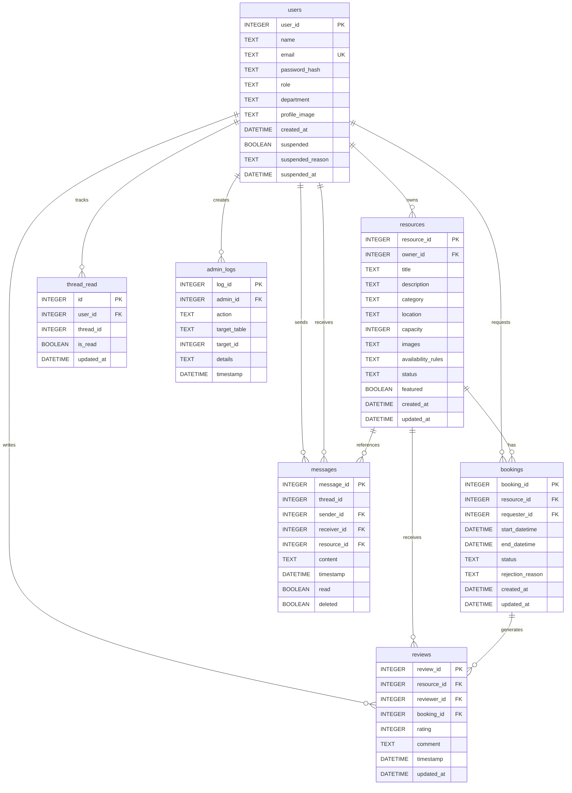

# Entity Relationship Diagram (ERD) and Database Schema

## Entity Relationship Diagram

## Database Schema

### Table: users

**Description:** Stores user account information including authentication details and profile data.

**Columns:**

| Column Name | Data Type | Constraints | Description |
|------------|-----------|-------------|-------------|
| user_id | INTEGER | PRIMARY KEY, AUTOINCREMENT | Unique identifier for each user |
| name | TEXT | NOT NULL | User's full name |
| email | TEXT | NOT NULL, UNIQUE | User's email address (unique, used for login) |
| password_hash | TEXT | NOT NULL | Bcrypt-hashed password |
| role | TEXT | NOT NULL, CHECK | User role: 'student', 'staff', or 'admin' |
| department | TEXT | NULL | User's department (optional) |
| profile_image | TEXT | NULL | Path to user's profile image file |
| created_at | DATETIME | DEFAULT CURRENT_TIMESTAMP | Account creation timestamp |
| suspended | BOOLEAN | DEFAULT 0 | Account suspension status |
| suspended_reason | TEXT | NULL | Reason for account suspension |
| suspended_at | DATETIME | NULL | Timestamp when account was suspended |

**Indexes:**
- `idx_users_email` on `email` (for fast login lookups)

**Relationships:**
- One-to-Many with `resources` (owner_id)
- One-to-Many with `bookings` (requester_id)
- One-to-Many with `messages` (sender_id and receiver_id)
- One-to-Many with `reviews` (reviewer_id)
- One-to-Many with `thread_read` (user_id)
- One-to-Many with `admin_logs` (admin_id)

---

### Table: resources

**Description:** Stores information about campus resources that can be booked (study rooms, equipment, spaces, etc.).

**Columns:**

| Column Name | Data Type | Constraints | Description |
|------------|-----------|-------------|-------------|
| resource_id | INTEGER | PRIMARY KEY, AUTOINCREMENT | Unique identifier for each resource |
| owner_id | INTEGER | NOT NULL, FOREIGN KEY | Reference to users.user_id (resource owner) |
| title | TEXT | NOT NULL | Resource title/name |
| description | TEXT | NULL | Detailed description of the resource |
| category | TEXT | NOT NULL, CHECK | Category: 'study_room', 'lab_equipment', 'av_equipment', 'event_space', 'tutoring', 'other' |
| location | TEXT | NOT NULL | Physical location of the resource |
| capacity | INTEGER | CHECK (capacity IS NULL OR capacity > 0) | Maximum capacity (optional, NULL allowed) |
| images | TEXT | NULL | JSON array of image file paths |
| availability_rules | TEXT | NULL | JSON blob describing recurring availability rules |
| status | TEXT | DEFAULT 'draft', CHECK | Status: 'draft', 'published', or 'archived' |
| featured | BOOLEAN | DEFAULT 0 | Whether resource is featured/promoted |
| created_at | DATETIME | DEFAULT CURRENT_TIMESTAMP | Resource creation timestamp |
| updated_at | DATETIME | DEFAULT CURRENT_TIMESTAMP | Last update timestamp |

**Indexes:**
- `idx_resources_owner` on `owner_id` (for filtering by owner)
- `idx_resources_status` on `status` (for filtering published resources)
- `idx_resources_category` on `category` (for category-based searches)

**Relationships:**
- Many-to-One with `users` (owner_id)
- One-to-Many with `bookings` (resource_id)
- One-to-Many with `reviews` (resource_id)
- One-to-Many with `messages` (resource_id)

---

### Table: bookings

**Description:** Stores booking requests and reservations for resources.

**Columns:**

| Column Name | Data Type | Constraints | Description |
|------------|-----------|-------------|-------------|
| booking_id | INTEGER | PRIMARY KEY, AUTOINCREMENT | Unique identifier for each booking |
| resource_id | INTEGER | NOT NULL, FOREIGN KEY | Reference to resources.resource_id |
| requester_id | INTEGER | NOT NULL, FOREIGN KEY | Reference to users.user_id (person making booking) |
| start_datetime | DATETIME | NOT NULL | Booking start date and time |
| end_datetime | DATETIME | NOT NULL | Booking end date and time |
| status | TEXT | DEFAULT 'approved', CHECK | Status: 'approved', 'cancelled', or 'completed' |
| rejection_reason | TEXT | NULL | Reason for rejection (if applicable) |
| created_at | DATETIME | DEFAULT CURRENT_TIMESTAMP | Booking creation timestamp |
| updated_at | DATETIME | DEFAULT CURRENT_TIMESTAMP | Last update timestamp |

**Indexes:**
- `idx_bookings_resource` on `resource_id` (for resource booking history)
- `idx_bookings_requester` on `requester_id` (for user booking history)
- `idx_bookings_datetime` on `start_datetime, end_datetime` (for conflict detection)

**Relationships:**
- Many-to-One with `resources` (resource_id)
- Many-to-One with `users` (requester_id)
- One-to-Many with `reviews` (booking_id)

**Business Rules:**
- `end_datetime` must be after `start_datetime` (enforced at application level)
- Conflict detection (overlapping bookings) enforced at application level

---

### Table: messages

**Description:** Stores messaging communication between users, optionally related to resources.

**Columns:**

| Column Name | Data Type | Constraints | Description |
|------------|-----------|-------------|-------------|
| message_id | INTEGER | PRIMARY KEY, AUTOINCREMENT | Unique identifier for each message |
| thread_id | INTEGER | NOT NULL | Thread identifier for grouping related messages |
| sender_id | INTEGER | NOT NULL, FOREIGN KEY | Reference to users.user_id (message sender) |
| receiver_id | INTEGER | NOT NULL, FOREIGN KEY | Reference to users.user_id (message receiver) |
| resource_id | INTEGER | NULL, FOREIGN KEY | Reference to resources.resource_id (optional context) |
| content | TEXT | NOT NULL | Message content/text |
| timestamp | DATETIME | DEFAULT CURRENT_TIMESTAMP | Message send timestamp |
| read | BOOLEAN | DEFAULT 0 | Whether message has been read by receiver |
| deleted | BOOLEAN | DEFAULT 0 | Soft delete flag |

**Indexes:**
- `idx_messages_thread` on `thread_id` (for thread retrieval)

**Relationships:**
- Many-to-One with `users` (sender_id)
- Many-to-One with `users` (receiver_id)
- Many-to-One with `resources` (resource_id)

---

### Table: thread_read

**Description:** Tracks thread-level read/unread status for users.

**Columns:**

| Column Name | Data Type | Constraints | Description |
|------------|-----------|-------------|-------------|
| id | INTEGER | PRIMARY KEY, AUTOINCREMENT | Unique identifier |
| user_id | INTEGER | NOT NULL, FOREIGN KEY | Reference to users.user_id |
| thread_id | INTEGER | NOT NULL | Thread identifier |
| is_read | BOOLEAN | DEFAULT 0 | Read status for this thread and user |
| updated_at | DATETIME | DEFAULT CURRENT_TIMESTAMP | Last update timestamp |

**Constraints:**
- UNIQUE constraint on `(user_id, thread_id)` to prevent duplicate entries

**Relationships:**
- Many-to-One with `users` (user_id)

---

### Table: reviews

**Description:** Stores user reviews and ratings for resources.

**Columns:**

| Column Name | Data Type | Constraints | Description |
|------------|-----------|-------------|-------------|
| review_id | INTEGER | PRIMARY KEY, AUTOINCREMENT | Unique identifier for each review |
| resource_id | INTEGER | NOT NULL, FOREIGN KEY | Reference to resources.resource_id |
| reviewer_id | INTEGER | NOT NULL, FOREIGN KEY | Reference to users.user_id (review author) |
| booking_id | INTEGER | NULL, FOREIGN KEY | Reference to bookings.booking_id (optional) |
| rating | INTEGER | NOT NULL, CHECK | Rating from 1 to 5 |
| comment | TEXT | NULL | Review comment/text |
| timestamp | DATETIME | DEFAULT CURRENT_TIMESTAMP | Review creation timestamp |
| updated_at | DATETIME | DEFAULT CURRENT_TIMESTAMP | Last update timestamp |

**Constraints:**
- UNIQUE constraint on `(resource_id, reviewer_id)` to prevent multiple reviews per user per resource

**Indexes:**
- `idx_reviews_resource` on `resource_id` (for resource review aggregation)
- `idx_reviews_reviewer` on `reviewer_id` (for user review history)

**Relationships:**
- Many-to-One with `resources` (resource_id)
- Many-to-One with `users` (reviewer_id)
- Many-to-One with `bookings` (booking_id)

---

### Table: admin_logs

**Description:** Audit log of administrative actions performed in the system.

**Columns:**

| Column Name | Data Type | Constraints | Description |
|------------|-----------|-------------|-------------|
| log_id | INTEGER | PRIMARY KEY, AUTOINCREMENT | Unique identifier for each log entry |
| admin_id | INTEGER | NOT NULL, FOREIGN KEY | Reference to users.user_id (admin who performed action) |
| action | TEXT | NOT NULL | Description of the action performed |
| target_table | TEXT | NULL | Database table affected by the action |
| target_id | INTEGER | NULL | ID of the record affected |
| details | TEXT | NULL | Additional details about the action |
| timestamp | DATETIME | DEFAULT CURRENT_TIMESTAMP | Action timestamp |

**Relationships:**
- Many-to-One with `users` (admin_id)

---

## Relationships Summary

### Primary Relationships

1. **users → resources** (One-to-Many)
   - Each user can own multiple resources
   - Foreign key: `resources.owner_id` → `users.user_id`

2. **users → bookings** (One-to-Many)
   - Each user can make multiple booking requests
   - Foreign key: `bookings.requester_id` → `users.user_id`

3. **resources → bookings** (One-to-Many)
   - Each resource can have multiple bookings
   - Foreign key: `bookings.resource_id` → `resources.resource_id`

4. **resources → reviews** (One-to-Many)
   - Each resource can have multiple reviews
   - Foreign key: `reviews.resource_id` → `resources.resource_id`

5. **users → reviews** (One-to-Many)
   - Each user can write multiple reviews
   - Foreign key: `reviews.reviewer_id` → `users.user_id`

6. **users → messages** (One-to-Many, bidirectional)
   - Each user can send multiple messages (sender_id)
   - Each user can receive multiple messages (receiver_id)
   - Foreign keys: `messages.sender_id` → `users.user_id`, `messages.receiver_id` → `users.user_id`

7. **bookings → reviews** (One-to-Many)
   - Each booking can have a review (optional)
   - Foreign key: `reviews.booking_id` → `bookings.booking_id`

8. **resources → messages** (One-to-Many)
   - Messages can reference a resource (optional context)
   - Foreign key: `messages.resource_id` → `resources.resource_id`

---

## Data Types and Constraints

### CHECK Constraints

- **users.role**: Must be one of: 'student', 'staff', 'admin'
- **resources.category**: Must be one of: 'study_room', 'lab_equipment', 'av_equipment', 'event_space', 'tutoring', 'other'
- **resources.status**: Must be one of: 'draft', 'published', 'archived'
- **resources.capacity**: Must be NULL or greater than 0
- **bookings.status**: Must be one of: 'approved', 'cancelled', 'completed'
- **reviews.rating**: Must be between 1 and 5 (inclusive)

### Default Values

- **users.suspended**: Defaults to 0 (false)
- **resources.status**: Defaults to 'draft'
- **resources.featured**: Defaults to 0 (false)
- **bookings.status**: Defaults to 'approved'
- **messages.read**: Defaults to 0 (false)
- **messages.deleted**: Defaults to 0 (false)
- **thread_read.is_read**: Defaults to 0 (false)

### Timestamps

All tables with timestamps use `DATETIME DEFAULT CURRENT_TIMESTAMP` for automatic timestamp creation.

---

## Indexes

### Performance Indexes

1. **users**
   - `idx_users_email` on `email` - Fast login lookups

2. **resources**
   - `idx_resources_owner` on `owner_id` - Filter resources by owner
   - `idx_resources_status` on `status` - Filter published resources
   - `idx_resources_category` on `category` - Category-based searches

3. **bookings**
   - `idx_bookings_resource` on `resource_id` - Resource booking history
   - `idx_bookings_requester` on `requester_id` - User booking history
   - `idx_bookings_datetime` on `start_datetime, end_datetime` - Conflict detection

4. **messages**
   - `idx_messages_thread` on `thread_id` - Thread message retrieval

5. **reviews**
   - `idx_reviews_resource` on `resource_id` - Resource review aggregation
   - `idx_reviews_reviewer` on `reviewer_id` - User review history

---

## Database Configuration

- **Database Type**: SQLite3
- **Database File**: `campus_resource_hub.db` (configurable via `DATABASE_PATH` environment variable)
- **Connection Management**: Context manager pattern with automatic transaction handling
- **Row Factory**: sqlite3.Row (dict-like row access)

---

## Notes

1. **Soft Deletes**: The `messages` table uses a `deleted` flag for soft deletion rather than hard deletes.

2. **JSON Storage**: `resources.images` and `resources.availability_rules` store JSON data as TEXT, which is parsed at the application level.

3. **Thread Management**: Messages use a `thread_id` for grouping, with additional `thread_read` table for tracking read status per user per thread.

4. **Review Constraints**: The unique constraint on `(resource_id, reviewer_id)` ensures each user can only write one review per resource, but reviews can be updated.

5. **Capacity Field**: The `resources.capacity` field allows NULL values to support resources that don't have capacity limits (e.g., some equipment).

6. **Suspension Tracking**: User suspension is tracked with `suspended`, `suspended_reason`, and `suspended_at` fields for audit purposes.

